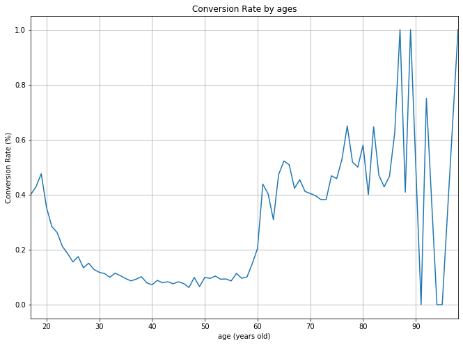
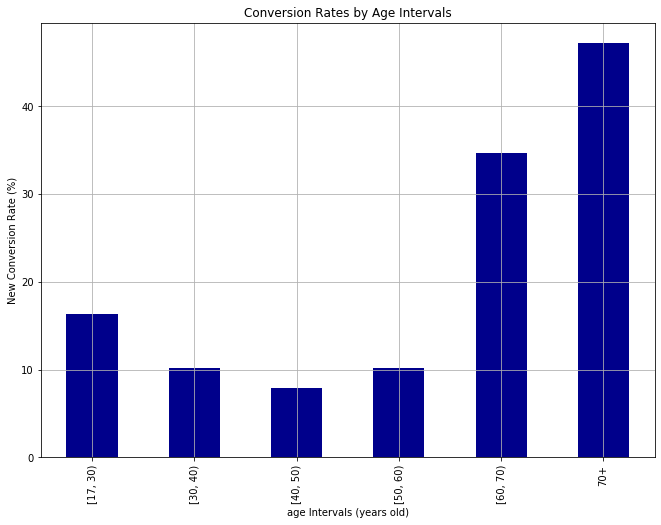

```python
import numpy as np
import pandas as pd
import matplotlib.pyplot as plt
%matplotlib inline
```


```python
# Load data
# Name the data frame as df for simplicity
df = pd.read_csv("bank-full-add-data.csv", sep = ';')
```


```python
# Next do the exploratory data ananysis (EDA)

# Have a look at data
df.head()
```


<div>
<style scoped>
    .dataframe tbody tr th:only-of-type {
        vertical-align: middle;
    }

    .dataframe tbody tr th {
        vertical-align: top;
    }

    .dataframe thead th {
        text-align: right;
    }
</style>
<table border="1" class="dataframe">
  <thead>
    <tr style="text-align: right;">
      <th></th>
      <th>age</th>
      <th>job</th>
      <th>marital</th>
      <th>education</th>
      <th>default</th>
      <th>housing</th>
      <th>loan</th>
      <th>contact</th>
      <th>month</th>
      <th>day_of_week</th>
      <th>...</th>
      <th>campaign</th>
      <th>pdays</th>
      <th>previous</th>
      <th>poutcome</th>
      <th>emp.var.rate</th>
      <th>cons.price.idx</th>
      <th>cons.conf.idx</th>
      <th>euribor3m</th>
      <th>nr.employed</th>
      <th>y</th>
    </tr>
  </thead>
  <tbody>
    <tr>
      <td>0</td>
      <td>56</td>
      <td>housemaid</td>
      <td>married</td>
      <td>basic.4y</td>
      <td>no</td>
      <td>no</td>
      <td>no</td>
      <td>telephone</td>
      <td>may</td>
      <td>mon</td>
      <td>...</td>
      <td>1</td>
      <td>999</td>
      <td>0</td>
      <td>nonexistent</td>
      <td>1.1</td>
      <td>93.994</td>
      <td>-36.4</td>
      <td>4.857</td>
      <td>5191.0</td>
      <td>no</td>
    </tr>
    <tr>
      <td>1</td>
      <td>57</td>
      <td>services</td>
      <td>married</td>
      <td>high.school</td>
      <td>unknown</td>
      <td>no</td>
      <td>no</td>
      <td>telephone</td>
      <td>may</td>
      <td>mon</td>
      <td>...</td>
      <td>1</td>
      <td>999</td>
      <td>0</td>
      <td>nonexistent</td>
      <td>1.1</td>
      <td>93.994</td>
      <td>-36.4</td>
      <td>4.857</td>
      <td>5191.0</td>
      <td>no</td>
    </tr>
    <tr>
      <td>2</td>
      <td>37</td>
      <td>services</td>
      <td>married</td>
      <td>high.school</td>
      <td>no</td>
      <td>yes</td>
      <td>no</td>
      <td>telephone</td>
      <td>may</td>
      <td>mon</td>
      <td>...</td>
      <td>1</td>
      <td>999</td>
      <td>0</td>
      <td>nonexistent</td>
      <td>1.1</td>
      <td>93.994</td>
      <td>-36.4</td>
      <td>4.857</td>
      <td>5191.0</td>
      <td>no</td>
    </tr>
    <tr>
      <td>3</td>
      <td>40</td>
      <td>admin.</td>
      <td>married</td>
      <td>basic.6y</td>
      <td>no</td>
      <td>no</td>
      <td>no</td>
      <td>telephone</td>
      <td>may</td>
      <td>mon</td>
      <td>...</td>
      <td>1</td>
      <td>999</td>
      <td>0</td>
      <td>nonexistent</td>
      <td>1.1</td>
      <td>93.994</td>
      <td>-36.4</td>
      <td>4.857</td>
      <td>5191.0</td>
      <td>no</td>
    </tr>
    <tr>
      <td>4</td>
      <td>56</td>
      <td>services</td>
      <td>married</td>
      <td>high.school</td>
      <td>no</td>
      <td>no</td>
      <td>yes</td>
      <td>telephone</td>
      <td>may</td>
      <td>mon</td>
      <td>...</td>
      <td>1</td>
      <td>999</td>
      <td>0</td>
      <td>nonexistent</td>
      <td>1.1</td>
      <td>93.994</td>
      <td>-36.4</td>
      <td>4.857</td>
      <td>5191.0</td>
      <td>no</td>
    </tr>
  </tbody>
</table>
<p>5 rows × 21 columns</p>
</div>


```python
df.shape
```


    (41188, 21)


```python
# Find out any missing columns
df.isnull().sum()
```


    age               0
    job               0
    marital           0
    education         0
    default           0
    housing           0
    loan              0
    contact           0
    month             0
    day_of_week       0
    duration          0
    campaign          0
    pdays             0
    previous          0
    poutcome          0
    emp.var.rate      0
    cons.price.idx    0
    cons.conf.idx     0
    euribor3m         0
    nr.employed       0
    y                 0
    dtype: int64


```python
# Our goal is modeling "y"
# Check variable "y"
df["y"].value_counts()
```


    no     36548
    yes     4640
    Name: y, dtype: int64


```python
# Find the conversion rate
# Create a column using 0 (no) and 1 (yes)
df["converCol"] = df["y"].apply(lambda x: 1 if x == "yes" else 0)
```


```python
df[["y", "converCol"]]
```


<div>
<style scoped>
    .dataframe tbody tr th:only-of-type {
        vertical-align: middle;
    }

    .dataframe tbody tr th {
        vertical-align: top;
    }

    .dataframe thead th {
        text-align: right;
    }
</style>
<table border="1" class="dataframe">
  <thead>
    <tr style="text-align: right;">
      <th></th>
      <th>y</th>
      <th>converCol</th>
    </tr>
  </thead>
  <tbody>
    <tr>
      <td>0</td>
      <td>no</td>
      <td>0</td>
    </tr>
    <tr>
      <td>1</td>
      <td>no</td>
      <td>0</td>
    </tr>
    <tr>
      <td>2</td>
      <td>no</td>
      <td>0</td>
    </tr>
    <tr>
      <td>3</td>
      <td>no</td>
      <td>0</td>
    </tr>
    <tr>
      <td>4</td>
      <td>no</td>
      <td>0</td>
    </tr>
    <tr>
      <td>...</td>
      <td>...</td>
      <td>...</td>
    </tr>
    <tr>
      <td>41183</td>
      <td>yes</td>
      <td>1</td>
    </tr>
    <tr>
      <td>41184</td>
      <td>no</td>
      <td>0</td>
    </tr>
    <tr>
      <td>41185</td>
      <td>no</td>
      <td>0</td>
    </tr>
    <tr>
      <td>41186</td>
      <td>yes</td>
      <td>1</td>
    </tr>
    <tr>
      <td>41187</td>
      <td>no</td>
      <td>0</td>
    </tr>
  </tbody>
</table>
<p>41188 rows × 2 columns</p>
</div>


```python
df.head(10)
```


<div>
<style scoped>
    .dataframe tbody tr th:only-of-type {
        vertical-align: middle;
    }

    .dataframe tbody tr th {
        vertical-align: top;
    }

    .dataframe thead th {
        text-align: right;
    }
</style>
<table border="1" class="dataframe">
  <thead>
    <tr style="text-align: right;">
      <th></th>
      <th>age</th>
      <th>job</th>
      <th>marital</th>
      <th>education</th>
      <th>default</th>
      <th>housing</th>
      <th>loan</th>
      <th>contact</th>
      <th>month</th>
      <th>day_of_week</th>
      <th>...</th>
      <th>pdays</th>
      <th>previous</th>
      <th>poutcome</th>
      <th>emp.var.rate</th>
      <th>cons.price.idx</th>
      <th>cons.conf.idx</th>
      <th>euribor3m</th>
      <th>nr.employed</th>
      <th>y</th>
      <th>converCol</th>
    </tr>
  </thead>
  <tbody>
    <tr>
      <td>0</td>
      <td>56</td>
      <td>housemaid</td>
      <td>married</td>
      <td>basic.4y</td>
      <td>no</td>
      <td>no</td>
      <td>no</td>
      <td>telephone</td>
      <td>may</td>
      <td>mon</td>
      <td>...</td>
      <td>999</td>
      <td>0</td>
      <td>nonexistent</td>
      <td>1.1</td>
      <td>93.994</td>
      <td>-36.4</td>
      <td>4.857</td>
      <td>5191.0</td>
      <td>no</td>
      <td>0</td>
    </tr>
    <tr>
      <td>1</td>
      <td>57</td>
      <td>services</td>
      <td>married</td>
      <td>high.school</td>
      <td>unknown</td>
      <td>no</td>
      <td>no</td>
      <td>telephone</td>
      <td>may</td>
      <td>mon</td>
      <td>...</td>
      <td>999</td>
      <td>0</td>
      <td>nonexistent</td>
      <td>1.1</td>
      <td>93.994</td>
      <td>-36.4</td>
      <td>4.857</td>
      <td>5191.0</td>
      <td>no</td>
      <td>0</td>
    </tr>
    <tr>
      <td>2</td>
      <td>37</td>
      <td>services</td>
      <td>married</td>
      <td>high.school</td>
      <td>no</td>
      <td>yes</td>
      <td>no</td>
      <td>telephone</td>
      <td>may</td>
      <td>mon</td>
      <td>...</td>
      <td>999</td>
      <td>0</td>
      <td>nonexistent</td>
      <td>1.1</td>
      <td>93.994</td>
      <td>-36.4</td>
      <td>4.857</td>
      <td>5191.0</td>
      <td>no</td>
      <td>0</td>
    </tr>
    <tr>
      <td>3</td>
      <td>40</td>
      <td>admin.</td>
      <td>married</td>
      <td>basic.6y</td>
      <td>no</td>
      <td>no</td>
      <td>no</td>
      <td>telephone</td>
      <td>may</td>
      <td>mon</td>
      <td>...</td>
      <td>999</td>
      <td>0</td>
      <td>nonexistent</td>
      <td>1.1</td>
      <td>93.994</td>
      <td>-36.4</td>
      <td>4.857</td>
      <td>5191.0</td>
      <td>no</td>
      <td>0</td>
    </tr>
    <tr>
      <td>4</td>
      <td>56</td>
      <td>services</td>
      <td>married</td>
      <td>high.school</td>
      <td>no</td>
      <td>no</td>
      <td>yes</td>
      <td>telephone</td>
      <td>may</td>
      <td>mon</td>
      <td>...</td>
      <td>999</td>
      <td>0</td>
      <td>nonexistent</td>
      <td>1.1</td>
      <td>93.994</td>
      <td>-36.4</td>
      <td>4.857</td>
      <td>5191.0</td>
      <td>no</td>
      <td>0</td>
    </tr>
    <tr>
      <td>5</td>
      <td>45</td>
      <td>services</td>
      <td>married</td>
      <td>basic.9y</td>
      <td>unknown</td>
      <td>no</td>
      <td>no</td>
      <td>telephone</td>
      <td>may</td>
      <td>mon</td>
      <td>...</td>
      <td>999</td>
      <td>0</td>
      <td>nonexistent</td>
      <td>1.1</td>
      <td>93.994</td>
      <td>-36.4</td>
      <td>4.857</td>
      <td>5191.0</td>
      <td>no</td>
      <td>0</td>
    </tr>
    <tr>
      <td>6</td>
      <td>59</td>
      <td>admin.</td>
      <td>married</td>
      <td>professional.course</td>
      <td>no</td>
      <td>no</td>
      <td>no</td>
      <td>telephone</td>
      <td>may</td>
      <td>mon</td>
      <td>...</td>
      <td>999</td>
      <td>0</td>
      <td>nonexistent</td>
      <td>1.1</td>
      <td>93.994</td>
      <td>-36.4</td>
      <td>4.857</td>
      <td>5191.0</td>
      <td>no</td>
      <td>0</td>
    </tr>
    <tr>
      <td>7</td>
      <td>41</td>
      <td>blue-collar</td>
      <td>married</td>
      <td>unknown</td>
      <td>unknown</td>
      <td>no</td>
      <td>no</td>
      <td>telephone</td>
      <td>may</td>
      <td>mon</td>
      <td>...</td>
      <td>999</td>
      <td>0</td>
      <td>nonexistent</td>
      <td>1.1</td>
      <td>93.994</td>
      <td>-36.4</td>
      <td>4.857</td>
      <td>5191.0</td>
      <td>no</td>
      <td>0</td>
    </tr>
    <tr>
      <td>8</td>
      <td>24</td>
      <td>technician</td>
      <td>single</td>
      <td>professional.course</td>
      <td>no</td>
      <td>yes</td>
      <td>no</td>
      <td>telephone</td>
      <td>may</td>
      <td>mon</td>
      <td>...</td>
      <td>999</td>
      <td>0</td>
      <td>nonexistent</td>
      <td>1.1</td>
      <td>93.994</td>
      <td>-36.4</td>
      <td>4.857</td>
      <td>5191.0</td>
      <td>no</td>
      <td>0</td>
    </tr>
    <tr>
      <td>9</td>
      <td>25</td>
      <td>services</td>
      <td>single</td>
      <td>high.school</td>
      <td>no</td>
      <td>yes</td>
      <td>no</td>
      <td>telephone</td>
      <td>may</td>
      <td>mon</td>
      <td>...</td>
      <td>999</td>
      <td>0</td>
      <td>nonexistent</td>
      <td>1.1</td>
      <td>93.994</td>
      <td>-36.4</td>
      <td>4.857</td>
      <td>5191.0</td>
      <td>no</td>
      <td>0</td>
    </tr>
  </tbody>
</table>
<p>10 rows × 22 columns</p>
</div>


```python
# Once we made the column of 0 and 1, 
# we can sum to get a total number of yes
numeraConvRate = df["converCol"].sum()
```


```python
print(numeraConvRate)
```

    4640
    


```python
denomConvRate = df.shape[0]
```


```python
print(denomConvRate)
```

    41188
    


```python
conversionRate = numeraConvRate / denomConvRate * 100
print(conversionRate)
```

    11.265417111780131
    


```python
# Analyze how these conversion rates vary among different age groups.
df.groupby(["age"])["converCol"].sum()
```


    age
    17     2
    18    12
    19    20
    20    23
    21    29
          ..
    91     0
    92     3
    94     0
    95     0
    98     2
    Name: converCol, Length: 78, dtype: int64


```python
df.groupby(["age"])["converCol"].count()
```


    age
    17      5
    18     28
    19     42
    20     65
    21    102
         ... 
    91      2
    92      4
    94      1
    95      1
    98      2
    Name: converCol, Length: 78, dtype: int64


```python
converRatebyAge = df.groupby(["age"])["converCol"].sum()/df.groupby(["age"])["converCol"].count()
```


```python
print(converRatebyAge)
```

    age
    17    0.400000
    18    0.428571
    19    0.476190
    20    0.353846
    21    0.284314
            ...   
    91    0.000000
    92    0.750000
    94    0.000000
    95    0.000000
    98    1.000000
    Name: converCol, Length: 78, dtype: float64
    


```python
# Plots
ax = converRatebyAge.plot(figsize = (11, 8), grid = True,
                         title = "Conversion Rate by ages",
)

ax.set_xlabel("age (years old)")
ax.set_ylabel('Conversion Rate (%)')
plt.show()
```





```python
df.groupby('age')['converCol'].count()
```


    age
    17      5
    18     28
    19     42
    20     65
    21    102
         ... 
    91      2
    92      4
    94      1
    95      1
    98      2
    Name: converCol, Length: 78, dtype: int64


```python
df["groupedAge"] = df['age'].apply(
    lambda x: '[17, 30)' if x < 30 else '[30, 40)' if x < 40 \
        else '[40, 50)' if x < 50 else '[50, 60)' if x < 60 \
        else '[60, 70)' if x < 70 else '70+'
)
```


```python
AgeInterval = df.groupby(["groupedAge"]
          )["converCol"].sum() / df.groupby(
    ["groupedAge"])["converCol"].count() * 100
```


```python
print(AgeInterval)
```

    groupedAge
    70+         47.121535
    [17, 30)    16.263891
    [30, 40)    10.125162
    [40, 50)     7.923238
    [50, 60)    10.157389
    [60, 70)    34.668508
    Name: converCol, dtype: float64
    


```python
ax = AgeInterval.loc[
    ['[17, 30)', '[30, 40)', '[40, 50)', '[50, 60)', '[60, 70)', '70+']
].plot(
    kind='bar',
    color='darkblue',
    grid=True,
    figsize=(11, 8),
    title='Conversion Rates by Age Intervals'
)

ax.set_xlabel('age Intervals (years old)')
ax.set_ylabel('New Conversion Rate (%)')

plt.show()
```




